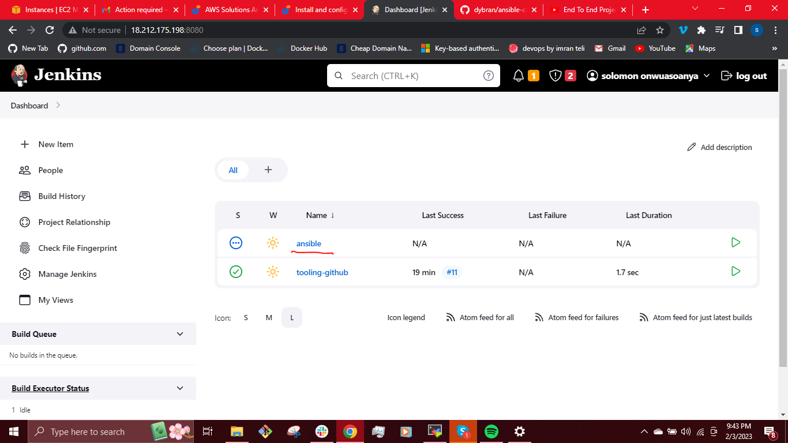
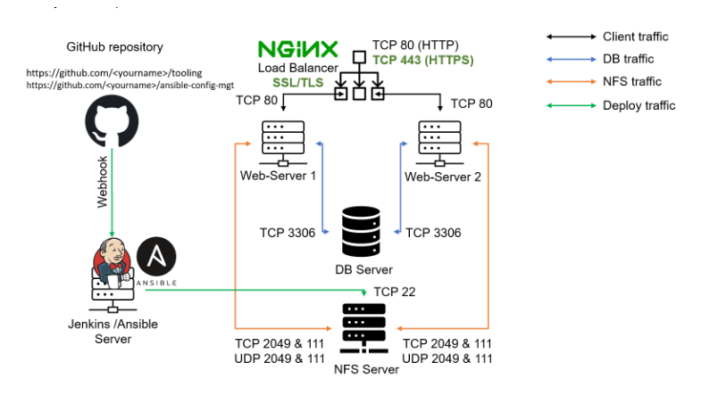
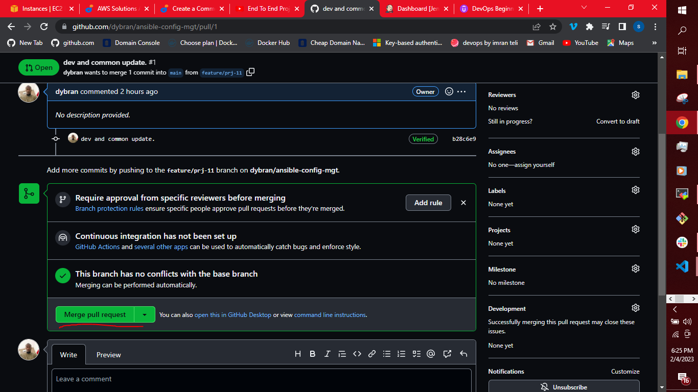
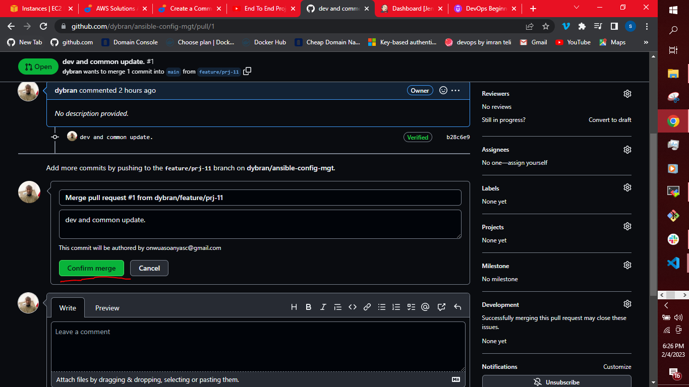
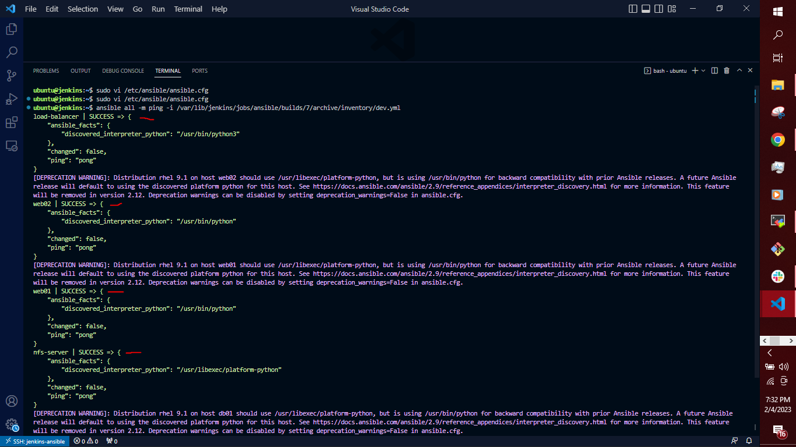
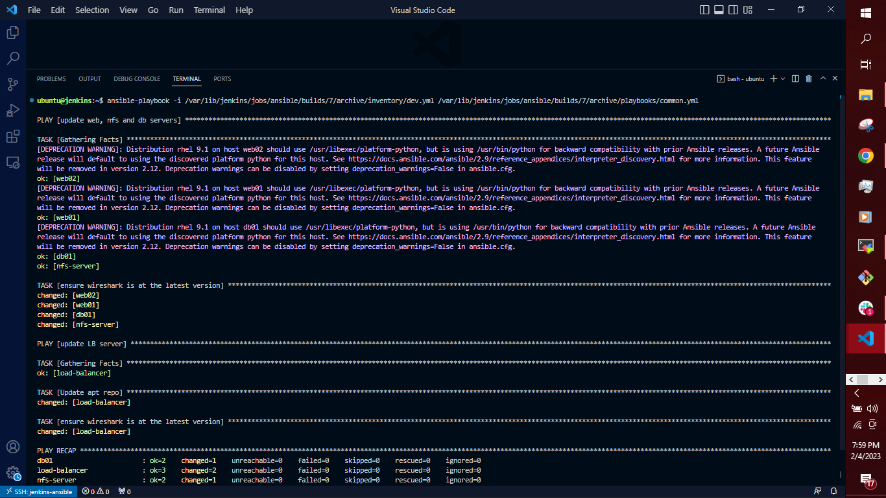
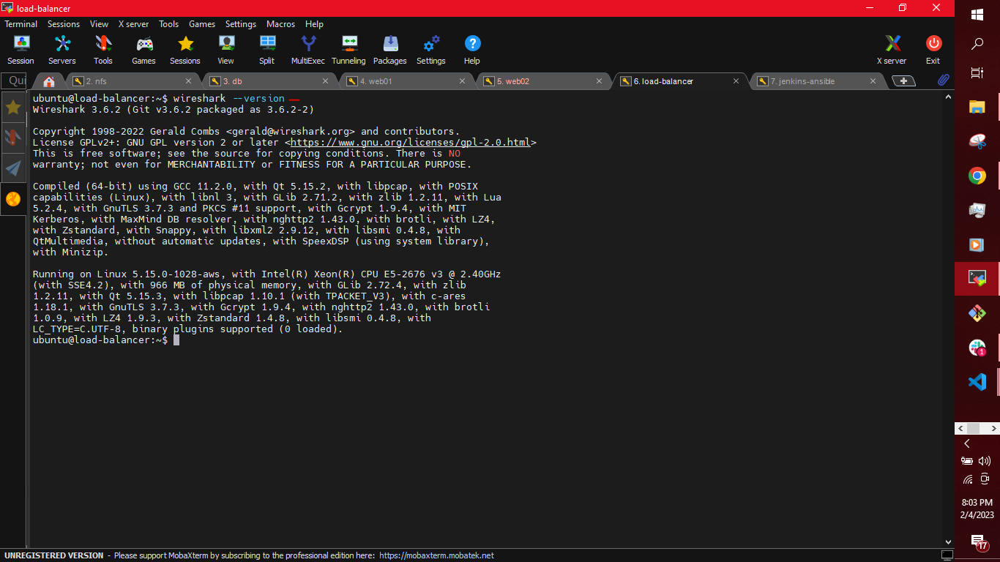

## __AUTOMATING PROJECTS 7-10 USING  ANSIBLE CONFIGURATION MANAGEMENT__ ##

In Projects 7-10, we had to perform lots of manual operations to set up virtual servers, install and configure required software,and deploy our web application.

 We will automate the routine tasks with Ansible Configuration Management using declarative language such as __YAML.__
 
 __ANSIBLE CLIENT AS A JUMP SERVER (BASTION HOST)__

 A __Jump Server(Bastion Host)__ is an intermediary server through which access to internal network can be provided. In the current architecture we have been working on, the webservers are inside a secured network which cannot be reached directly from the Internet. To access the webservers using SSH, we need to go through a __jump server__ which provides a better security and reduced attack.

In the diagram below, the Virtual Private Network (VPC) is divided into two subnets – Public subnet has public IP addresses and Private subnet is only reachable by private IP addresses.


We will be performing the following tasks:
- Install and configure Ansible client to act as a Jump Server/Bastion Host.
- Create a simple Ansible playbook to automate servers configuration.

__INSTALL AND CONFIGURE ANSIBLE ON EC2 INSTANCE__

We will update the __Name tag__ on our __Jenkins EC2 Instance__ to __Jenkins-Ansible.__ We will use this server to run our playbooks.


In the GitHub account, we create a new repository and name it __ansible-config-mgt.__


Update the repository and Install Ansible

`$ sudo apt update -y && sudo apt install ansible`


To known if ansible is installed successfully, we check for the Ansible version by running

`$ ansible --version`


Configure Jenkins build job to save your repository content every time there is an edit. Go to __"configure"__ and edit the following:


Create a new Freestyle project ansible in Jenkins and point it to your __‘ansible-config-mgt’__ repository.



Configure the __"ansible-config-mgt"__ to connect to the jenkins through webhook to trigger build automatically. In the __"ansible-config-mgt"__ repository, we click on __settings__.
Click on __"webhook"__-Then click on __"add webhook"__.


In the __"project URL"__, put in the jenkins IP address and select __"application/json"__ in the __"content type"__.

`<jenkins-IP-address>:8080/github-webhook/`


Then click on __""add webhook"__.

Configure a Post-build job to save and archive all artifacts i.e (**).

To perform the above tasks, go to [project-9](https://github.com/dybran/Project-9/blob/main/project-9.md).

We can test our setup by making some change in __README.MD__ file.


The build is triggered automatically and Jenkins saves the files (build artifacts) in `/var/lib/jenkins/jobs/ansible/builds/<build_number>/archive/` folder.


To check if the artifacts from the build was saved and archived successfully, we run the command:

`sudo vi /var/lib/jenkins/jobs/ansible/builds/<build_number>/archive/`


The architecture now looks like this



__N/B:__

Every time the jenkins-ansible server stop/start, we have to reconfigure GitHub webhook to the new IP address. In order to avoid this, we allocate an Elastic IP to the Jenkins-Ansible server. Elastic IP is free only when it is being allocated to an EC2 Instance so we release Elastic IP once the instance is terminated.

Refer to [project-10](https://github.com/dybran/Project-10/blob/main/project-10.md) to learn how to allocate Elastic IP.

__PREPARE THE DEVELOPMENT ENVIRONMENT__

There are varieties of IDEs available but we will be using __Vscode.__ You can install __vscode__ [here](https://code.visualstudio.com/download).

After we are done with the Vscode set up, we need to install an extension known as __Remote Development extension Pack__. This extension allows us to access folders in a container or on a remote machine.


Clone the __ansible-config-mgt repo__ to the Jenkins-Ansible instance

`$ git clone <ansible-config-mgt repo link>`


`cd` into __ansible-config-mgt__


__BEGIN ANSIBLE DEVELOPMENT__

In the __ansible-config-mgt GitHub repository__, We create a new branch that will be used for development of a new feature and name it `feature/prj-11`

To create this branch, we run the commands

`$ git status`

To show the present branch. Then

`$ git checkout -b feature/prj-11`

and then

`$ git status`

To show the branch we just changed into


In the new branch we will be creating some directories that we will be working with.
- create a directory __playbooks.__


- create a directory __inventory.__


- In the __playbooks__ directory, create a file __common.yml__
- Within the inventory folder, create an inventory file (.yml) for each environment (Development, Staging Testing and Production) __dev, staging, uat, and prod__ respectively.


__Set up an Ansible Inventory__

We will write an ansible inventory file which defines the hosts and groups of hosts upon which commands, modules, and tasks in a playbook operate which executes Linux commands on remote hosts.

__Note:__ Ansible uses TCP port 22 by default, which means it needs to ssh into target servers from __Jenkins-Ansible__ host – for this we will need to import the key into ssh-agent.

To setup SSH agent and connect VS Code to the Jenkins-Ansible instance. Click [here](https://www.youtube.com/watch?v=OplGrY74qog).

Open the link [openSSH-documentation](https://learn.microsoft.com/en-us/windows-server/administration/openssh/openssh_install_firstuse?tabs=powershell) and follow the setup procedure.


To add the key we run the command
eval 

`$ ssh-agent -s`

`$ ssh-add <path-to-private-key>`

To Confirm the key has been added, we run

`$ ssh-add -l`

Then ssh into the Jenkins-Ansible server using ssh-agent

`$ ssh -A ubuntu@<jenkins-ansible-IP-address>`


To Connect the vscode to the server through ssh, click on the highlighted section in the bottom left corner


Search for __"ssh"__, then select __"open ssh configuration file"__ from the options. Select `c:\Users\user\.ssh\config`

Insert the following

```
host: test
    hostname: <public-dns-of-jenkins-ansible-server> 
    user: ubuntu
    ForwardAgent: yes
```


click on the highlighted section in the bottom left corner again
i.e 

and then select __"connect to host".__ From the options select the host you created in the __ssh configuration file.__

This connects the jenkins-ansible server to vscode remotely through ssh


We try to connect remotely through ssh to other servers. 

e.g Connect to  __web02__ remotely

`$ ssh ec2-user@<web02-IP-address>`


Update the `/etc/hosts/` of the __jenkins-ansible__ server with the __webservers, database, nfs server and load balancer__ private IP address.

`$ sudo vi /etc/hosts`


Update the __inventory/dev.yml__ file with the folowing:

```
nfs-server ansible_host=<NFS-Server-Private-IP-Address> ansible_ssh_user=ec2-user ansible_ssh_private_key_file=dybran-ec2.pem

web01 ansible_host=<Web-Server1-Private-IP-Address> ansible_ssh_user=ec2-user ansible_ssh_private_key_file=dybran-ec2.pem

web02 ansible_host=<Web-Server2-Private-IP-Address> ansible_ssh_user=ec2-user ansible_ssh_private_key_file=dybran-ec2.pem

db01 ansible_host=<Database-Private-IP-Address> ansible_ssh_user=ec2-user ansible_ssh_private_key_file=dybran-ec2.pem

load-balancer ansible_host=<Load-Balancer-Private-IP-Address> ansible_ssh_user=ubuntu ansible_ssh_private_key_file=dybran-ec2.pem

[nfs]
nfs-server

[webservers]
web01
web02

[db]
db01 

[lb]
load-balancer
```


__CREATE A COMMON PLAYBOOK__

In `common.yml` playbook we will write configuration for repeatable, re-usable, and multi-machine tasks that is common to systems within the infrastructure.

Update the `playbooks/common.yml` file with following:

```
---
- name: update web, nfs and db servers
  hosts: webservers, nfs-server, db01
  remote_user: ec2-user
  become: yes
  become_user: root
  tasks:
    - name: ensure wireshark is at the latest version
      yum:
        name: wireshark
        state: latest

- name: update LB server
  hosts: load-balancer
  remote_user: ubuntu
  become: yes
  become_user: root
  tasks:
    - name: Update apt repo
      apt: 
        update_cache: yes

    - name: ensure wireshark is at the latest version
      apt:
        name: wireshark
        state: latest
```

The above playbook will install the latest __wireshark__ utility to the various servers.


__Update GIT with the latest code__

Now all of the directories and files are in the local machine(our computer) and we need to push changes made locally to GitHub.

Ideally, We will be working within a team of other DevOps engineers and developers where collaboration is a key component. GIT helps us collabrate in a DevOps team . In many organisations there is a development rule that do not allow to deploy any code before it has been reviewed by an extra pair of eyes – it is also called __"Four eyes principle".__

Now we need to raise a __pull request__ for the `feature/prj-11` branch we created and the branch peer reviewed and merged to the  __main__ branch.

Commit your code into GitHub

We will use git commands to add, commit and push the branch to GitHub

`$ git status`

`$ git add <selected files>`

`$ git commit -m "commit message"`


Create a Pull request (PR)

Click on __pull requests__


Click on __new pull request__


Select the branch i.e __feature/prj-11__


Click on __create pull request__


The __pull requests__ section will be updated showing that the pull request was a success.


The __pull request__ will be reviewed and if it is approved, it will be __merged__ to the __main__ branch.

The merge process include

__Merge pull request__



__Confirm merge__



After the merge is done, the __inventory__ and __playbooks__ directories are updated in the __main__ branch.


Switch to the __main__ branch

`$ git checkout main`

then download the updated copy

`$ git pull`


When this is done, our jenkins builds the artifacts automatically.


 then saves the files in the `/var/lib/jenkins/jobs/ansible/builds/<build_number>/archive/` directory on the jenkins-ansible server.


__Run Ansible test__

We __cd__ into __ansible-config-mgt__

`$ cd ansible-config-mgt`

To test if we can access the other servers, we run the command

`$ ansible all -m ping -i /var/lib/jenkins/jobs/ansible/builds/<build_number>/archive/inventory/dev.yml`



__Note:__ if we do not want __"host key checking"__, We can uncomment `#host_key_checking=False` in the `/etc/ansible/ansible.cfg` file.


To run our playbook, We check fi the syntax is __OK__ by running the command

`$ ansible-playbook -i /var/lib/jenkins/jobs/ansible/builds/<build_number>/archive/inventory/dev.yml /var/lib/jenkins/jobs/ansible/builds/<build_number>/archive/playbooks/common.yml --syntax-check`

If the syntax is __OK__, the playbook will be displayed.

i.e `playbook: <playbook-file-path>`

For a __Dry Run__ to see what actually happens when you run the playbook.

`$ ansible-playbook -i /var/lib/jenkins/jobs/ansible/builds/<build_number>/archive/inventory/dev.yml /var/lib/jenkins/jobs/ansible/builds/<build_number>/archive/playbooks/common.yml -C`


To run the playbook

`$ ansible-playbook -i /var/lib/jenkins/jobs/ansible/builds/<build_number>/archive/inventory/dev.yml /var/lib/jenkins/jobs/ansible/builds/<build_number>/archive/playbooks/common.yml`




If there are no errors, check if __wireshark__ is installed in each of the servers by logging into the servers and running the command

`$ which wireshark` __OR__ `$ wireshark --version`




__Note:__ Ansible is __Idempotent__. __Idempotency__ means that if an ansible playbook is run severally, it only makes the change to the server once unless there is a change in the playbook. 

Now the updated architecture looks like this


We have just automated routine tasks using Ansible configuration management tool.


  


